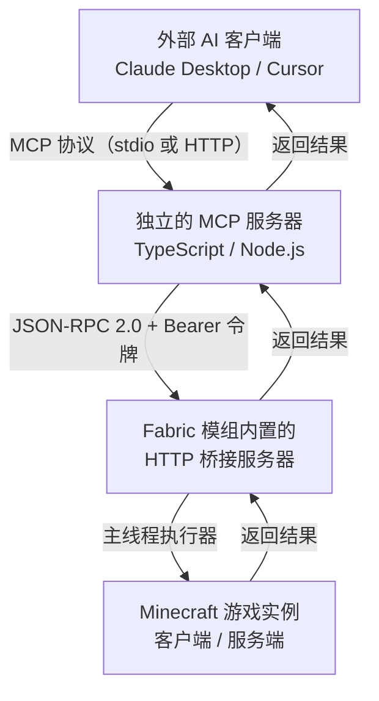

# MCP Bridge

一座架在 Minecraft 内部的桥：让 Claude Desktop、Cursor 这类外部 AI 助手，通过标准 MCP 协议**观察、理解并操控游戏世界**。

仓库布局：

| 部分        | 位置            | 职责                                                    |
| --------- | ------------- | ----------------------------------------------------- |
| Fabric 模组 | `fabric/`     | 在 MC 内部起一个本地 HTTP 服务，把所有操作安全调度到游戏主线程                  |
| MCP 服务器   | `mcp-server/` | TypeScript 实现的 MCP server，把 AI 的工具调用翻译成对游戏内 HTTP 桥的请求 |
| 客户端示例   | `examples/`   | Claude Desktop 等客户端的 MCP 配置样例                                  |
| 调试工具    | `tools/`      | 直连游戏内 HTTP 桥的命令行脚本（不经过 MCP server）                          |


---

## 架构



三层职责边界很清晰：

- **AI 客户端**只认识 MCP，完全不知道 Minecraft 的存在。
- **MCP 服务器**只做协议翻译和参数校验，不持有任何游戏状态，可以随时重启而不影响游戏。
- **Fabric 模组**是唯一接触游戏状态的组件，也是唯一需要关心线程安全的地方。

### 一次调用的完整链路

```
Claude: "把脚下的方块换成石头"
  → MCP tool: get_player            → HTTP POST /rpc {"method":"get_player"} → 主线程执行 → 返回坐标
  → MCP tool: get_block  {x,y,z-1}  → HTTP POST /rpc {"method":"get_block"}  → 返回 minecraft:grass_block
  → MCP tool: set_block  {x,y,z-1, block:"minecraft:stone"}
                                    → HTTP POST /rpc                          → 主线程 setBlockState → 返回新状态
```

---
## 使用演示
https://www.bilibili.com/video/BV1TwYJ6JENZ

---

## 快速开始

### 1. 构建并安装模组

```bash
cd fabric
./gradlew build          # Windows 用 gradlew.bat
```

> wrapper 默认从腾讯镜像拉取 Gradle。  
> 需要官方源的话修改 `fabric/gradle/wrapper/gradle-wrapper.properties` 里的 `distributionUrl` 即可。

产物在 `fabric/build/libs/mcpbridge-0.1.0.jar`，丢进 `.minecraft/mods/`（同时需要 [Fabric Loader](https://fabricmc.net/) 与 Fabric API）。

开发环境下直接 `./gradlew runClient` 或 `runServer` 即可。

### 2. 启动游戏，拿到令牌

进入任意单人世界（或启动专用服务端）后，日志里会出现：

```
[mcpbridge] HTTP 桥已启动：http://127.0.0.1:8765/rpc
[mcpbridge] 令牌：3f9a...（64 位十六进制）
```

令牌同时写入 `.minecraft/(version)/(版本名)/config/mcpbridge.token`，配置文件在 `.minecraft/(version)/(版本名)/config/mcpbridge.json`。
括号中的内容表示开启了版本隔离后的路径变化。

### 3. 启动 MCP 服务器

```bash
cd mcp-server
npm install
npm run build
```

最快的心智负担最低的方式是让服务器自己找令牌（见 `config.ts` 的候选路径），也可以显式指定：

```bash
export MCPBRIDGE_TOKEN=<你的令牌>
node dist/index.js
```

> PowerShell 下用 `$env:MCPBRIDGE_TOKEN="<你的令牌>"` 代替 `export`。更多配置项见 `mcp-server/README.md`。

### 4. 接入 AI 客户端

`examples/claude_desktop_config.json` 是一份可直接改用的配置：

```json
{
  "mcpServers": {
    "minecraft": {
      "command": "node",
      "args": ["<本仓库路径>/mcp-server/dist/index.js"],
      "env": {
        "MCPBRIDGE_URL": "http://127.0.0.1:8765",
        "MCPBRIDGE_TOKEN": "把令牌填在这里"
      }
    }
  }
}
```

### 5. 验证

```bash
curl http://127.0.0.1:8765/health
```

返回 `{"status":"ok","worldReady":true,...}` 说明桥和世界都就绪了。

不想启动 MCP server 时，也可以用 `tools/call.mjs` 直连桥调试：

```bash
export MCPBRIDGE_TOKEN=<你的令牌>
node tools/call.mjs ping
node tools/call.mjs get_player
node tools/call.mjs set_block '{"x":0,"y":64,"z":0,"block":"minecraft:stone"}'
```

---

## 协议

### 端点

| 端点         | 方法   | 鉴权  | 说明               |
| ---------- | ---- | --- | ---------------- |
| `/rpc`     | POST | 需要  | JSON-RPC 2.0 主入口 |
| `/methods` | GET  | 需要  | 列出所有方法及参数 schema |
| `/health`  | GET  | 不需要 | 探活，返回权限等级与世界就绪状态 |

请求头统一为 `Authorization: Bearer <token>`。

### 请求 / 响应

```jsonc
// POST /rpc
{ "jsonrpc": "2.0", "id": 1, "method": "get_block", "params": { "x": 0, "y": 64, "z": 0 } }

// 成功
{ "jsonrpc": "2.0", "id": 1, "result": { "block": "minecraft:stone", "isAir": false, ... } }

// 失败（注意：协议层错误仍然返回 HTTP 200，错误语义在 error 字段里）
{ "jsonrpc": "2.0", "id": 1, "error": { "code": -32602, "message": "缺少必需参数: y" } }
```

### 错误码

| 码        | 含义                     |
| -------- | ---------------------- |
| `-32700` | JSON 解析失败              |
| `-32600` | 无效请求                   |
| `-32601` | 方法未注册                  |
| `-32602` | 参数非法（缺参、越界、ID 不存在、超范围） |
| `-32603` | 游戏内部错误                 |
| `-32010` | 未授权（HTTP 401）          |
| `-32011` | 权限等级不足                 |
| `-32001` | 主线程执行超时                |
| `-32002` | 世界/玩家尚未就绪              |

---

## 权限分级

配置里的 `permissionLevel` 决定 AI 能触达的上限，**默认 `build`**：

| 等级      | 能力         | 典型方法                                                                      |
| ------- | ---------- | ------------------------------------------------------------------------- |
| `read`  | 纯观察        | `get_block` / `get_entities` / `raycast` / `scan_blocks`                  |
| `build` | 一个普通玩家能做的事 | `set_block` / `player_move` / `send_chat` / `give_item` / `attack_entity` |
| `admin` | 服务器管理      | `run_command` / `set_time` / `set_weather`                                |

`admin` 之下还有第二道闸：`commandMode`（默认 `denylist`）会拦掉 `stop`、`op`、`deop`、`ban`、`kick`、`whitelist`、`datapack` 等危险指令；也可以改成 `allowlist` 只放行显式列出的指令，或 `off` 完全关闭命令执行。

---

## 工具清单

<details>

<summary>只读（read）</summary>

| 方法               | 说明                |
| ---------------- | ----------------- |
| `ping`           | 心跳与 tick          |
| `get_world_info` | 服务器 + 全维度概览       |
| `list_players`   | 在线玩家              |
| `get_player`     | 玩家完整状态            |
| `get_block`      | 读取单个方块            |
| `scan_blocks`    | 区域方块统计            |
| `find_block`     | 按类型查找最近方块         |
| `get_entities`   | 附近实体              |
| `get_inventory`  | 玩家背包              |
| `raycast`        | 视线命中的方块与实体        |
| `get_biome`      | 生物群系              |
| `get_events`     | 增量拉取事件（聊天/死亡/进出服） |
| `list_methods`   | 方法自检              |

</details>

<details>

<summary>建造（build）</summary>

| 方法              | 说明          |
| --------------- | ----------- |
| `set_block`     | 放置单个方块      |
| `fill_blocks`   | 区域填充        |
| `send_chat`     | 以玩家身份发言     |
| `player_move`   | 传送（含朝向与跨维度） |
| `player_look`   | 设置视角        |
| `look_at`       | 看向某坐标       |
| `give_item`     | 给予物品        |
| `attack_entity` | 攻击实体        |
| `set_held_slot` | 切换快捷栏       |

</details>

<details>

<summary>管理（admin）</summary>

| 方法            | 说明                  |
| ------------- | ------------------- |
| `run_command` | 以控制台身份执行指令（受黑白名单约束） |
| `set_time`    | 设置时间                |
| `set_weather` | 设置天气                |

</details>

---

## 安全

- **默认只绑 `127.0.0.1`**。想绑其它地址必须显式设置 `allowRemoteBinding=true`，启动时还会再打一条警告日志。
- 令牌是首次启动时用 `SecureRandom` 生成的 32 字节（64 位十六进制），比对走 `MessageDigest.isEqual`（恒定时间，防时序侧信道）。
- 请求体上限 1 MB，HTTP 线程固定 4 条，所有执行体都有超时。
- **令牌只在本地回环上传输**。真要远程访问，请套一层 TLS 反向代理，不要裸奔。

---

## 性能护栏

AI 很容易"随手"发出会卡死游戏的请求，所以每个可能放大的操作都有硬上限（可在配置文件调整）：

| 配置                    | 默认值    | 作用         |
| --------------------- | ------ | ---------- |
| `maxScanVolume`       | 250000 | 单次扫描的方块数上限 |
| `maxFillVolume`       | 32768  | 单次填充的方块数上限 |
| `maxRaycastDistance`  | 128    | 射线最大长度     |
| `maxEntitiesReturned` | 200    | 单次返回的实体数上限 |
| `requestTimeoutMs`    | 5000   | 主线程执行超时    |

注意：这些操作都在主线程上跑，护栏是为了避免"AI 一次请求卡住整个游戏"。

---

## 扩展一个新工具

三步，且两侧只需各加一处：

1. **模组侧**：在 `ReadMethods` / `BuildMethods` / `AdminMethods` 的 `register()` 里加一条
   ```java
   MethodRegistry.register("my_method", "说明", Permission.BUILD,
           Schema.of("说明", Schema.props("x", "integer"), "x"),
           args -> { /* 已经在主线程上，直接写游戏逻辑 */ });
   ```
2. **MCP 服务器侧**：在 `mcp-server/src/tools.ts` 的 `TOOLS` 里加一条同名的 `ToolDef`。
3. 重新构建两侧。

`list_methods` 会把模组侧的真实 schema 吐出来，可以用它核对两侧是否一致。

---

## 多版本 Minecraft

当前目标版本是 **1.21.1**（Fabric Loader 0.19.5 / Fabric API 0.116.17 / Yarn 1.21.1+build.3 / JDK 21）。

要支持多个 MC 版本，推荐用 [Stonecutter](https://stonecutter.kikugie.dev/)：把 `gradle.properties` 里的版本号换成版本矩阵，用 `//? if >=1.21.2 {` 之类的注释处理少数 API 差异。


---

## 故障排查

| 现象               | 原因与处理                                                       |
| ---------------- | ----------------------------------------------------------- |
| `/health` 连不上    | 模组没加载，或配置里 `enabled=false`，或端口被占用（改 `port`，设为 `0` 可让系统自动分配） |
| 401              | 令牌不一致。比对 `config/mcpbridge.token` 与客户端里的 `MCPBRIDGE_TOKEN`  |
| `-32002 游戏尚未就绪`  | 还没进世界。单人世界要真正进入存档，专用服务端要完成启动                                |
| `-32001 主线程执行超时` | 请求范围太大或世界卡顿。缩小范围，或调大 `requestTimeoutMs`                     |
| `-32011 权限等级不足`  | 把 `permissionLevel` 调高，或改用低权限等级的替代方法                        |
| AI 说找不到工具        | MCP 服务器没重启，或 `claude_desktop_config.json` 里的路径写错            |

---

## 开发与贡献

给 AI Agent 或协作者的开发说明放在 `AGENTS.md`：包含构建命令、两侧一致性约定、新增工具的步骤和已知坑，动手前先读它。

---

## 许可

MIT
